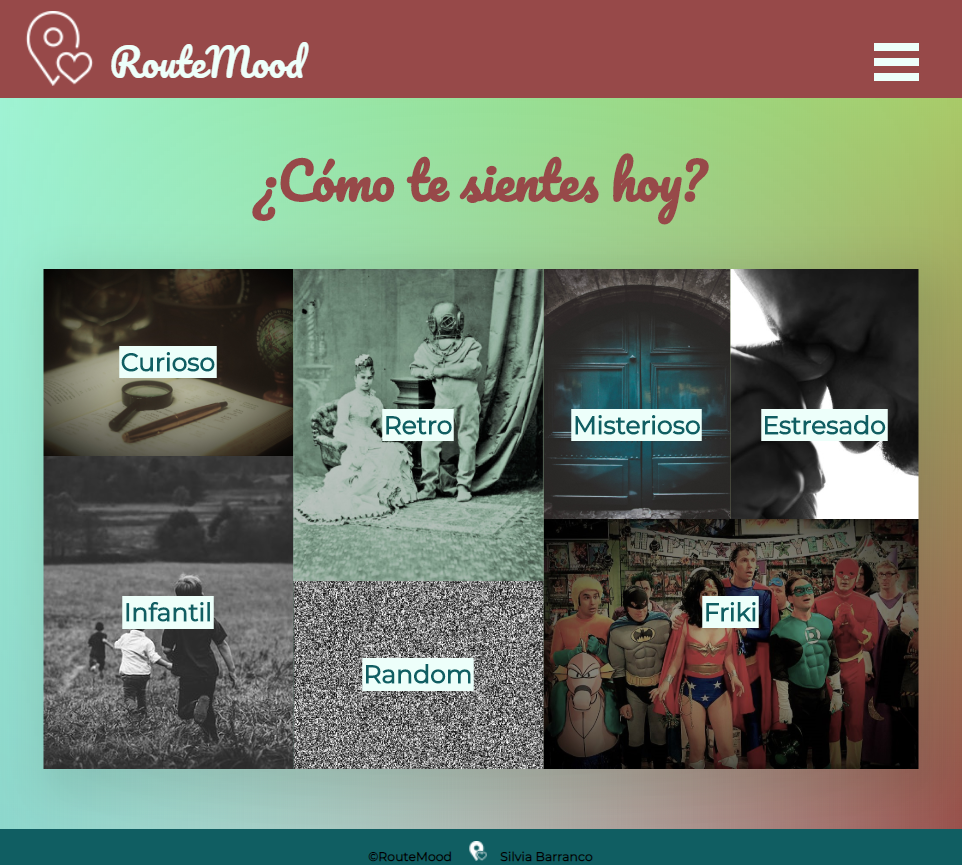
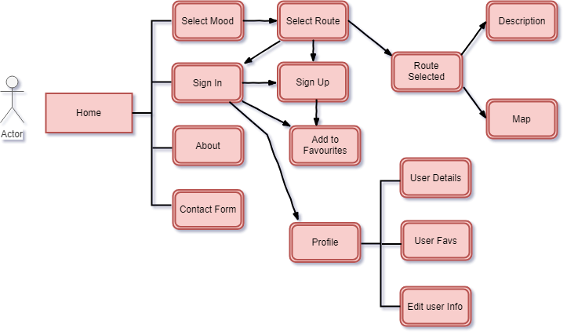
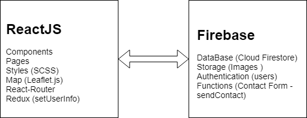

# Route Mood Project

Walking is a good way to clear the mind. Through the walks we offer ourselves the possibility of relativizing our problems and connecting with our deepest self, the one that in our day to day we do not pay attention. Depending on your mood, we suggest different routes to make you feel better. Discover the city and discover ourselves ... that's RouteMood.

This project has been developed for the final project of the Front-End Course in [SkylabCoders](https://www.skylabcoders.com/es/).

Live demo: https://my-project-1545145830346.firebaseapp.com/home

## Screenshoot

## Functional Description

When users enter to the **main page**, they can choose a **mood** or scroll down, where they can find information **about** the application and a **contact form** as well.  
After choosing the mood, users find all the routes assigned to that mood on the **select route page**. If users choose a random mood, the application returns just one random route.  
When users want to discover **more about** the selected route, they find a **route details page** that shows route **description** and locations points on the **map**.  
If users want to save a route as **favourite**, they have to **sign in** or **sign up**. Once users have sign in, they have access to their **profile page**, where can see their **user details**, their **favourites rutes** and **edit** their information.   

### Diagram

## Technologies

The front-end is created using ReactJS. Styled with SCSS.  
Maps are made with Leaftlet.js library.  
Back-end is created with Firebase and Cloud Firestore Database.  

### Diagram

### Components and Pages

- Components:
    - App
    - Header
        - Sidebar
    - HomeScroll
        - FirstComponent
        - SecondComponent
        - ThirdComponent
    - Loading
    - Footer
    - Maps
    - Modal
    - ProfileItems
        - EditProfile
        - FavRoutes
    - RouteDetail        
    - RouteItem
        - CardBody
        - CardHeader
    - SignIn
    - SignUp

- Pages:
    - Home
    - Login
    - RouteSelected
    - SelectRoute
    - UserProfile

## Author

[Silvia Barranco](https://github.com/sbarranco)

